# map-artistry

Artistic topographic map generator using OpenStreetMap, satellite imagery, and digital elevation
models. Generates high-resolution, stylized maps via a customizable pipeline.

## Dependencies

- [just](https://github.com/casey/just) 1.47.0 or newer — command runner (`brew install just` on
  macOS)
- Python 3

## Getting Started

First, download or clone the repository and switch to the project directory:

```bash
git clone https://github.com/paulstothard/map-artistry.git
cd map-artistry
```

Then proceed with the setup steps below.

## Setup

```bash
python3 -m venv venv
source venv/bin/activate
pip install -r requirements.txt
```

## Usage

```bash
# Build a map with default settings (24" × 24" @ 600 DPI, PNG format) - "coral" is the color scheme
just build "Edmonton, AB" coral

# Build with a different location and use the "natural" color scheme
just build "Vancouver Island, BC" natural

# Build with custom dimensions using the "river_runs_red" color scheme
just build --width 36 --height 24 "Iceland" river_runs_red

# Build with custom dimensions, DPI, format, boundary buffer, and "natural" color scheme
just build --width 24 --height 24 --dpi 600 --format png --buffer-km 20 "Victoria, BC" natural

# List available color schemes
just schemes
```

All settings (boundary padding, DEM source, satellite zoom, layer source) are calculated
automatically based on region size. Use `--buffer-km` to override the automatic extra distance added
around the region boundary, in kilometers.

### How Data Is Selected

The map pipeline chooses data sources dynamically from the estimated buffered area (`tier`). This
controls DEM source, satellite zoom, and vector layer source.

| Tier      |            Area (km²) | DEM source   | Satellite zoom | Vector layer source |
| --------- | --------------------: | ------------ | -------------: | ------------------- |
| city      |            `< 10,000` | `copernicus` |           `12` | `osm`               |
| region    |    `10,000 - 100,000` | `srtm`       |            `9` | `osm`               |
| country   | `100,000 - 1,000,000` | `cop90`      |            `8` | `natural-earth`     |
| continent |        `>= 1,000,000` | `etopo1`     |            `6` | `natural-earth`     |

Default buffer size also scales by area (`5`, `50`, `100`, `200` km), unless you set `--buffer-km`.

Color schemes also control layer visibility/opacity in `schemes/*.yaml`. The order below matches the
example image order:

- `coral` — hides natural and land use layers
- `river_runs_red` — hides natural and land use layers
- `natural` — hides roads, buildings, and land use layers
- `lava` — hides roads, buildings, and land use layers
- `glacier` — hides roads, buildings, and land use layers
- `satellite` — enables a satellite underlay with overlay layers

You can always override any of these defaults via per-location overlay configs.

## Color Schemes

Listed in the same order as each example image row.

- `coral` — red-toned terrain, white water; hides natural and land use layers
- `river_runs_red` — dark red/black terrain, red water; hides natural and land use layers
- `natural` — green→brown→grey→white terrain, blue water; hides roads, buildings, and land use
  layers
- `lava` — fiery terrain, orange water; hides roads, buildings, and land use layers
- `glacier` — cool grey-green terrain, blue-grey water; hides roads, buildings, and land use layers
- `satellite` — satellite imagery base with vector/map overlays; hides natural and land use layers

**Layer types:** natural (forests, wetlands, beaches, etc.), land use (urban areas), roads (street
network), buildings (footprints), water/waterway (bodies of water and streams).

## Examples

### Banff, AB

[](examples/full/banff-ab-coral.png)
[](examples/full/banff-ab-river_runs_red.png)
[](examples/full/banff-ab-natural.png)
[](examples/full/banff-ab-lava.png)
[](examples/full/banff-ab-glacier.png)
[](examples/full/banff-ab-satellite.png)

### British Columbia

[](examples/full/british-columbia-coral.png)
[](examples/full/british-columbia-river_runs_red.png)
[](examples/full/british-columbia-natural.png)
[](examples/full/british-columbia-lava.png)
[](examples/full/british-columbia-glacier.png)
[](examples/full/british-columbia-satellite.png)

### Cape Town, South Africa

[](examples/full/cape-town-south-africa-coral.png)
[](examples/full/cape-town-south-africa-river_runs_red.png)
[](examples/full/cape-town-south-africa-natural.png)
[](examples/full/cape-town-south-africa-lava.png)
[](examples/full/cape-town-south-africa-glacier.png)
[](examples/full/cape-town-south-africa-satellite.png)

### Crete, Greece

[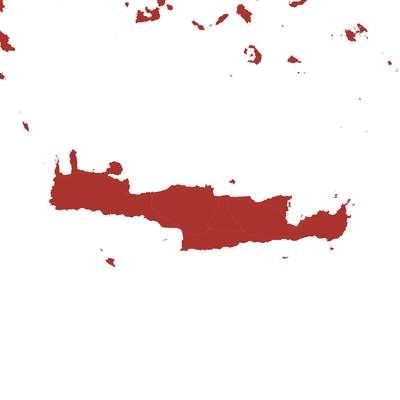](examples/full/crete-greece-coral.png)
[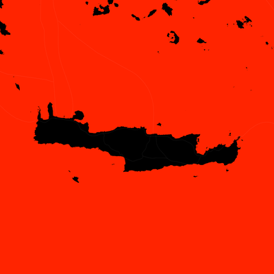](examples/full/crete-greece-river_runs_red.png)
[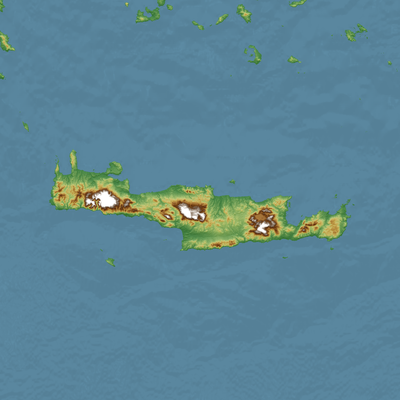](examples/full/crete-greece-natural.png)
[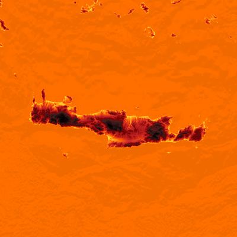](examples/full/crete-greece-lava.png)
[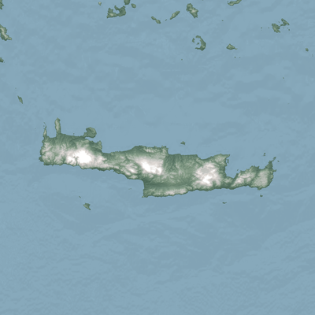](examples/full/crete-greece-glacier.png)
[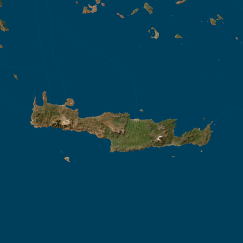](examples/full/crete-greece-satellite.png)

### Edmonton, AB

[](examples/full/edmonton-ab-coral.png)
[](examples/full/edmonton-ab-river_runs_red.png)
[](examples/full/edmonton-ab-natural.png)
[](examples/full/edmonton-ab-lava.png)
[](examples/full/edmonton-ab-glacier.png)
[](examples/full/edmonton-ab-satellite.png)

### Hokkaido, Japan

[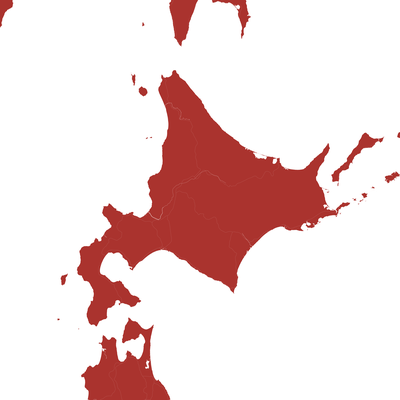](examples/full/hokkaido-japan-coral.png)
[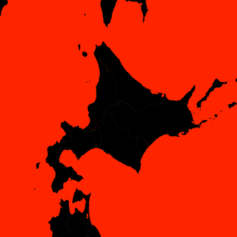](examples/full/hokkaido-japan-river_runs_red.png)
[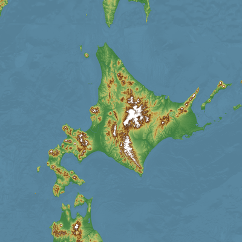](examples/full/hokkaido-japan-natural.png)
[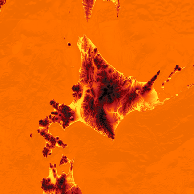](examples/full/hokkaido-japan-lava.png)
[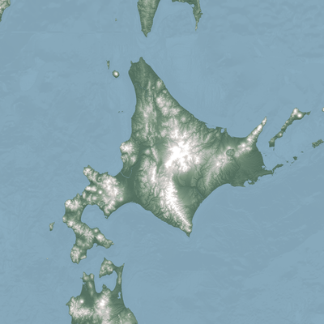](examples/full/hokkaido-japan-glacier.png)
[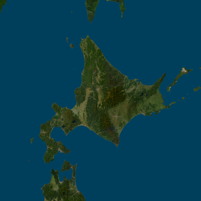](examples/full/hokkaido-japan-satellite.png)

### Iceland

[](examples/full/iceland-coral.png)
[](examples/full/iceland-river_runs_red.png)
[](examples/full/iceland-natural.png)
[](examples/full/iceland-lava.png)
[](examples/full/iceland-glacier.png)
[](examples/full/iceland-satellite.png)

### New Zealand

[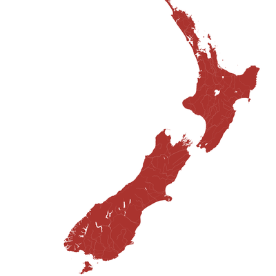](examples/full/new-zealand-coral.png)
[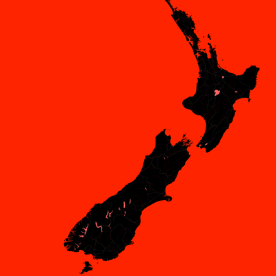](examples/full/new-zealand-river_runs_red.png)
[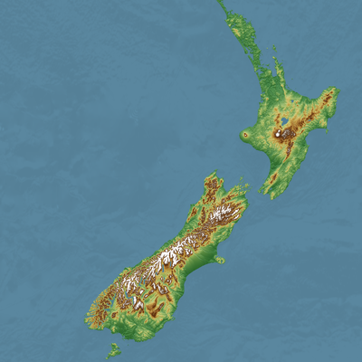](examples/full/new-zealand-natural.png)
[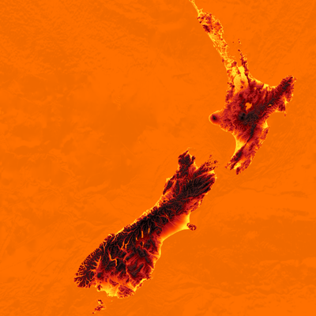](examples/full/new-zealand-lava.png)
[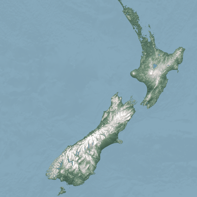](examples/full/new-zealand-glacier.png)
[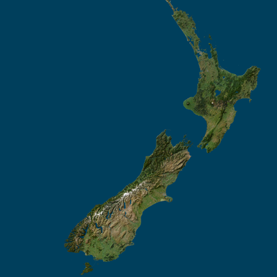](examples/full/new-zealand-satellite.png)

### Oahu, HI

[](examples/full/oahu-hi-coral.png)
[](examples/full/oahu-hi-river_runs_red.png)
[](examples/full/oahu-hi-natural.png)
[](examples/full/oahu-hi-lava.png)
[](examples/full/oahu-hi-glacier.png)
[](examples/full/oahu-hi-satellite.png)

### Patagonia

[](examples/full/patagonia-coral.png)
[](examples/full/patagonia-river_runs_red.png)
[](examples/full/patagonia-natural.png)
[](examples/full/patagonia-lava.png)
[](examples/full/patagonia-glacier.png)
[](examples/full/patagonia-satellite.png)

### San Francisco, CA

[](examples/full/san-francisco-ca-coral.png)
[](examples/full/san-francisco-ca-river_runs_red.png)
[](examples/full/san-francisco-ca-natural.png)
[](examples/full/san-francisco-ca-lava.png)
[](examples/full/san-francisco-ca-glacier.png)
[](examples/full/san-francisco-ca-satellite.png)

### Scotland

[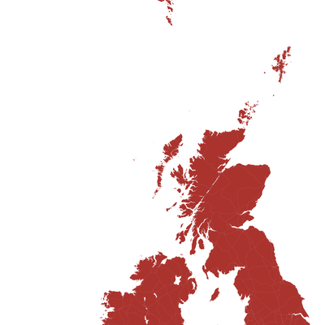](examples/full/scotland-coral.png)
[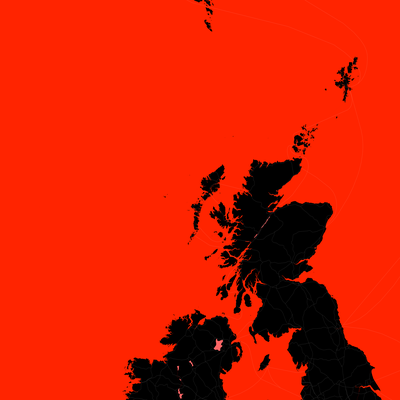](examples/full/scotland-river_runs_red.png)
[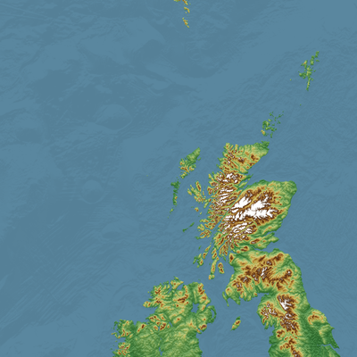](examples/full/scotland-natural.png)
[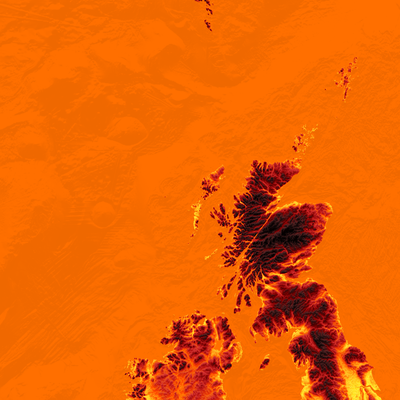](examples/full/scotland-lava.png)
[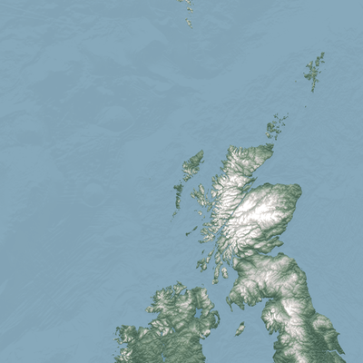](examples/full/scotland-glacier.png)
[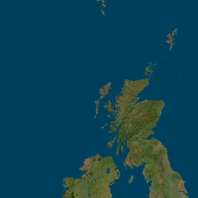](examples/full/scotland-satellite.png)

### Vancouver, BC

[](examples/full/vancouver-bc-coral.png)
[](examples/full/vancouver-bc-river_runs_red.png)
[](examples/full/vancouver-bc-natural.png)
[](examples/full/vancouver-bc-lava.png)
[](examples/full/vancouver-bc-glacier.png)
[](examples/full/vancouver-bc-satellite.png)

### Vancouver Island, BC

[](examples/full/vancouver-island-bc-coral.png)
[](examples/full/vancouver-island-bc-river_runs_red.png)
[](examples/full/vancouver-island-bc-natural.png)
[](examples/full/vancouver-island-bc-lava.png)
[](examples/full/vancouver-island-bc-glacier.png)
[](examples/full/vancouver-island-bc-satellite.png)

### Vestland, Norway

[](examples/full/vestland-norway-coral.png)
[](examples/full/vestland-norway-river_runs_red.png)
[](examples/full/vestland-norway-natural.png)
[](examples/full/vestland-norway-lava.png)
[](examples/full/vestland-norway-glacier.png)
[](examples/full/vestland-norway-satellite.png)

## Customizing a Map

Each build produces two auto-generated files:

- `configs/{location}-base.yaml` — full generated config
- `configs/{location}-{scheme}-final.yaml` — final merged config (used for rendering)
- `configs/{location}-{scheme}-overlay.yaml` — your optional customizations (place here to
  auto-apply)

Create an overlay file named `configs/{location}-{scheme}-overlay.yaml` and place it in `configs/`.
The build detects it automatically and deep-merges it over the base config to produce the final
config.

```bash
# 1. Build the map first to generate the config files
just build "Edmonton, AB" coral

# 2. Copy the current final config as your overlay starting point
cp configs/edmonton-ab-coral-final.yaml configs/edmonton-ab-coral-overlay.yaml

# 3. Edit it — change whatever you like; leave everything else as-is
vi configs/edmonton-ab-coral-overlay.yaml

# 4. Rebuild — the overlay is applied automatically
just build "Edmonton, AB" coral
```

Leaving unchanged keys in the overlay is fine — the merge just keeps the same value. The base config
is the raw generated config, while the `-final` file is the scheme-specific rendered config after
overlay merging, so it is the better starting point if you want to copy what the map is currently
using. The `{location}` is the region name lowercased with spaces and commas replaced by hyphens
(e.g. `Edmonton, AB` → `edmonton-ab`).

## Adding New Color Schemes

To create a new color scheme, simply add a new YAML file to the `schemes/` directory. Each color
scheme defines styling for all map layers (terrain, hillshade, water, roads, buildings, etc.),
including colors, visibility, opacity, line weights, and more.

The easiest approach is to copy an existing scheme file (e.g., `coral.yaml`, `natural.yaml`,
`glacier.yaml`) as a starting point, rename it, and modify the colors and settings to your liking:

```bash
# Copy an existing scheme as a template
cp schemes/coral.yaml schemes/my_scheme.yaml

# Edit the new scheme file
vi schemes/my_scheme.yaml

# The scheme is now available immediately
just build "Location" my_scheme
```

The scheme file should contain a YAML structure with `map` and layer-specific settings. For example:

```yaml
map:
  background:
    fc: "#ffffff"
    ec: "#ffffff"
  scheme: my_scheme
  # ... terrain, hillshade, satellite settings
water:
  fc: "#0000ff"
  ec: "#0000ff"
  alpha: 1.0
  # ... other water settings
# ... other layers (waterway, road, building, etc.)
```

After adding your YAML file to `schemes/`, the new color scheme is automatically discovered and can
be used in builds without any code changes.

## Ocean Data

For coastal regions, the pipeline can derive an ocean layer from the **World Seas (IHO Sea Areas)**
dataset. Download `World_Seas_IHO_v3.zip` from
[marineregions.org/downloads.php](https://www.marineregions.org/downloads.php), extract it, and
place the files into `downloads/ocean-boundaries/`. The build will skip ocean processing silently if
this directory is absent.

## Project Structure

```text
schemes/                     # Color scheme definitions (YAML files)
  coral.yaml                 # Coral color scheme
  natural.yaml               # Natural color scheme
  # ... other schemes

downloads/
  regions/                  # Per-region data (auto-downloaded)
    edmonton-ab/
      area.geojson           # Boundary polygon
      dem.tif                # Digital elevation model
      satellite.tif          # Satellite imagery
      layers/*.gpkg          # Vector layers (roads, water, etc.)
  ocean-boundaries/          # IHO World Seas source (manual download)

configs/                     # Base configs and optional overlays
output/                      # Rendered maps
cache/                       # OSM query cache (safe to delete)
scripts/                     # Pipeline scripts
```

## Cache

OSM query responses are cached in `cache/`. It can be deleted at any time to force fresh downloads.

## Author

Created by Paul Stothard.

## License

This project is licensed under the MIT License - see the [LICENSE](LICENSE) file for details.
