# map-artistry

Artistic topographic and GPX route map generator using OpenStreetMap, satellite imagery, and digital elevation models. Generates high-resolution, stylized region maps and route-overlay maps via a customizable pipeline.

<table align="center">
  <tr>
    <td width="50%">
      
    </td>
    <td width="50%">
      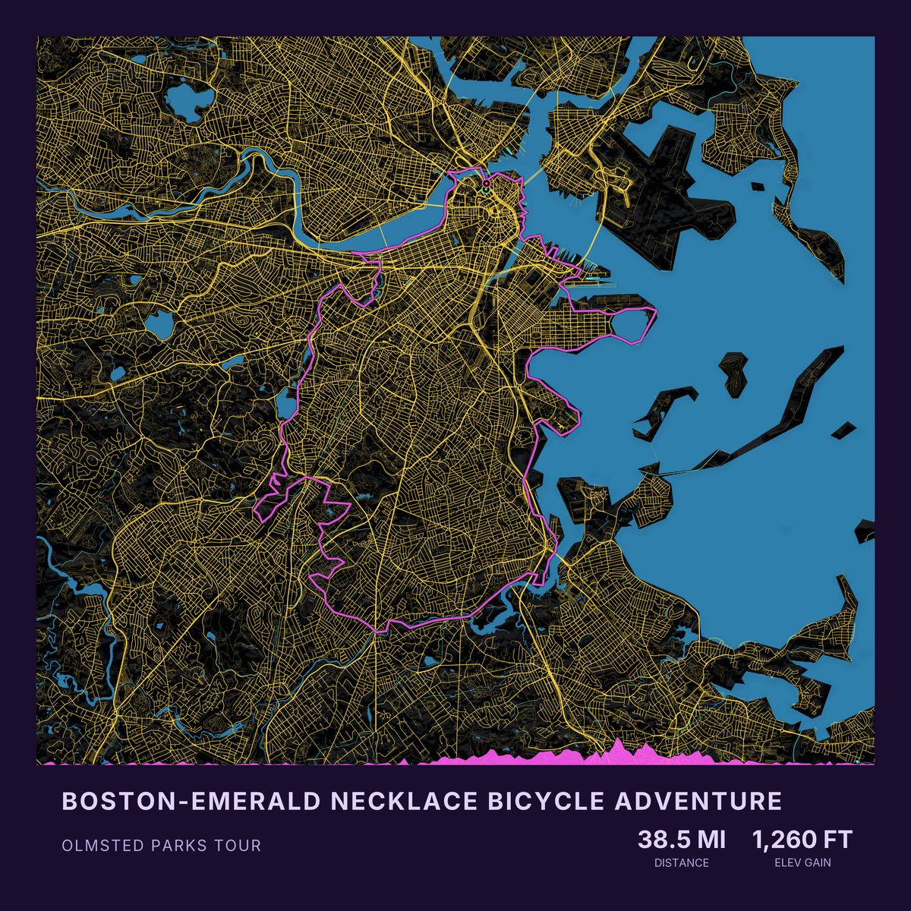
    </td>
  </tr>
</table>

## Dependencies

- [just](https://github.com/casey/just) 1.47.0 or newer — command runner (`brew install just` on macOS)
- Python 3
- **Inter font** — required for text rendering on maps

## Getting Started

First, download or clone the repository and switch to the project directory:

```bash
git clone https://github.com/paulstothard/map-artistry.git
cd map-artistry
```

Then proceed with the setup steps below.

## Setup

### 1. Install Inter Font

**macOS:**

```bash
brew install --cask font-inter
```

**Linux:**

```bash
# Download from Google Fonts
wget https://fonts.google.com/download?family=Inter -O inter.zip
unzip inter.zip -d inter
sudo mkdir -p /usr/share/fonts/truetype/inter
sudo cp inter/*.ttf /usr/share/fonts/truetype/inter/
fc-cache -f -v
```

**Windows:**

1. Download Inter from [Google Fonts](https://fonts.google.com/specimen/Inter)
2. Extract the zip file
3. Right-click on each `.ttf` file and select "Install"

**Verify installation:**

```bash
fc-list | grep -i inter
```

### 2. Install Python Dependencies

```bash
python3 -m venv venv
source venv/bin/activate
pip install -r requirements.txt
```

### 3. Understanding the Workspace Structure

The project separates code from data using two directories:

- **`examples/`** — pre-configured example maps with their configs and outputs (tracked in Git)
- **`user/`** — your personal workspace for creating custom maps (ignored by Git)

Both directories have the same structure: `cache/`, `configs/`, `downloads/`, and `output/`.

**By default, `just` commands use the `user/` workspace.** When you run `just build "City Name" scheme`, all configs, outputs, downloads, and cache files go to `user/configs/`, `user/output/`, `user/downloads/`, and `user/cache/`.

The examples workspace is only used when running `./generate-example-maps.sh`, which sets the workspace to `examples/` automatically.

### 4. Optional: Portable Justfile Usage

You can copy [justfile](justfile) elsewhere and point it back to this repository using environment variables:

```bash
# Copy justfile to your custom workspace
cp justfile ~/my-maps/
cd ~/my-maps

# Set the repo location and workspace
export MAP_ARTISTRY_REPO="/Users/yourusername/map-artistry"
export WORKSPACE_DIR="$PWD"

# Now run just commands from your custom location
just build "San Francisco, CA" coral
```

This creates all configs and outputs in your current directory while using the scripts and schemes from the repository.

**Environment variables:**

- `MAP_ARTISTRY_REPO` — path to the cloned repository (defaults to the directory containing justfile)
- `WORKSPACE_DIR` — path to your workspace directory (defaults to `user/` within the repo)

## Usage

### Standard Maps

```bash
# Build a map with default settings (24" × 24" @ 300 DPI, PNG format)
just build "Edmonton, AB" coral

# Build with a different location and color scheme
just build "Vancouver Island, BC" natural

# Build with custom dimensions
just build --width 36 --height 24 "Iceland" river_runs_red

# Build with custom dimensions, DPI, format, and boundary buffer
just build --width 24 --height 24 --dpi 300 --format png --buffer-km 20 "Victoria, BC" natural

# Build with title and subtitle panel
just build --text-title "VICTORIA" --text-subtitle "BRITISH COLUMBIA" "Victoria, BC" natural

# Build with title, subtitle, and custom stats
just build --text-title "SAN FRANCISCO" --text-subtitle "CALIFORNIA" --text-stats "37.77°N||LATITUDE;;122.42°W||LONGITUDE" "San Francisco, CA" coral

# Save output to a custom folder
just build --output-dir my-maps "Edmonton, AB" coral

# List available color schemes
just schemes
```

### Route Maps

Route maps overlay a GPX track on the map and optionally display a stats panel with title, subtitle, and custom metrics.

**Region + GPX route** — the map region is defined by a place name, with the GPX track drawn on top:

```bash
just build-route "Edmonton, AB" ./my-ride.gpx coral

# With a stats panel
just build-route \
  --text-title "EDMONTON LOOP" \
  --text-subtitle "SUMMER TRAINING RIDE" \
  --text-stats "94 KM||DISTANCE;;800 M||ELEV GAIN" \
  "Edmonton, AB" ./my-ride.gpx coral
```

**GPX-derived route** — the map region is derived automatically from the GPX track bounding box, no place name required:

```bash
just build-gpx ./my-ride.gpx coral

# With a stats panel
just build-gpx \
  --text-title "RIVER VALLEY LOOP" \
  --text-subtitle "GPX-DERIVED REGION" \
  --text-stats "64 KM||DISTANCE;;530 M||ELEV GAIN" \
  ./my-ride.gpx coral
```

All settings (boundary padding, DEM source, satellite zoom, layer source) are calculated automatically based on region size. Use `--buffer-km` to override the automatic extra distance added around the region boundary, in kilometers.

### Text Panels

All map types (`build`, `build-route`, and `build-gpx`) support optional text panels with title, subtitle, location, and custom statistics. Use the `--text-title`, `--text-subtitle`, `--text-location`, and `--text-stats` flags to add a styled info panel to your map. Stats use the format `VALUE||LABEL` with `;;` as a separator between multiple stats (e.g., `"94 KM||DISTANCE;;800 M||ELEV GAIN"`).

Route maps can derive distance metrics from the GPX track, while standard maps work well with custom stats like coordinates, elevation, area, or any other relevant information about the location.

### How Data Is Selected

The map pipeline chooses data sources dynamically from the estimated buffered area (`tier`). This controls DEM source, satellite zoom, and vector layer source.

| Tier      |            Area (km²) | DEM source   | Satellite zoom | Vector layer source |
| --------- | --------------------: | ------------ | -------------: | ------------------- |
| city      |            `< 10,000` | `copernicus` |           `12` | `osm`               |
| region    |    `10,000 - 100,000` | `srtm`       |            `9` | `osm`               |
| country   | `100,000 - 1,000,000` | `cop90`      |            `8` | `natural-earth`     |
| continent |        `>= 1,000,000` | `etopo1`     |            `6` | `natural-earth`     |

Default buffer size also scales by area (`5`, `50`, `100`, `200` km), unless you set `--buffer-km`.

Color schemes control layer visibility/opacity and styling in `schemes/*.yaml`. See the Color Schemes section below for details on each scheme. You can always override any defaults via per-location overlay configs.

## Color Schemes

Available color schemes (listed alphabetically):

`blueprint` • `burgundy` • `copper` • `coral` • `glacier` • `lava` • `minimal_white` • `natural` • `neon_cyber` • `night` • `porcelain_ink` • `river_runs_red` • `satellite` • `sepia_vintage` • `slate` • `yellow`

Each scheme controls layer visibility, colors, hillshade, and terrain rendering. See `schemes/*.yaml` for full configuration details.

## Examples

These README examples are `400×400` thumbnails linking to `1200×1200` full previews, rendered at `24" × 24" @ 150 DPI`. Full-resolution builds (default `300 DPI`) produce approximately `14400×14400` pixel images; use `--format pdf` for print-quality output.

### Banff, AB

<table>
  <tr>
    <td align="center">
      <a href="examples/full/banff-ab-blueprint.png">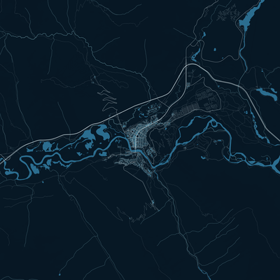</a><br>
      <sub>blueprint</sub>
    </td>
    <td align="center">
      <a href="examples/full/banff-ab-burgundy.png">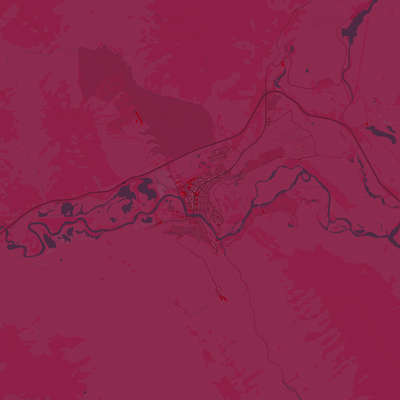</a><br>
      <sub>burgundy</sub>
    </td>
    <td align="center">
      <a href="examples/full/banff-ab-copper.png">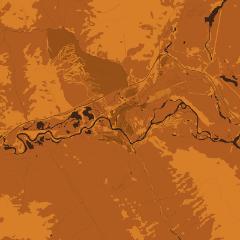</a><br>
      <sub>copper</sub>
    </td>
    <td align="center">
      <a href="examples/full/banff-ab-coral.png">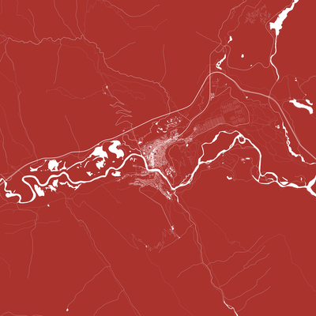</a><br>
      <sub>coral</sub>
    </td>
  </tr>
  <tr>
    <td align="center">
      <a href="examples/full/banff-ab-glacier.png">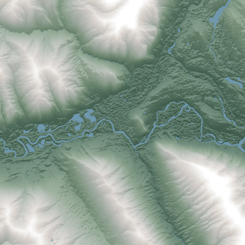</a><br>
      <sub>glacier</sub>
    </td>
    <td align="center">
      <a href="examples/full/banff-ab-lava.png">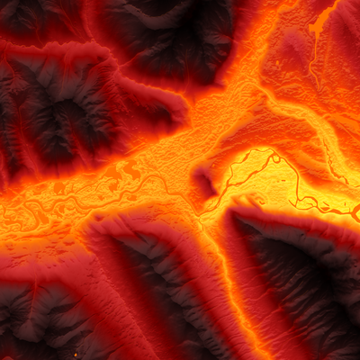</a><br>
      <sub>lava</sub>
    </td>
    <td align="center">
      <a href="examples/full/banff-ab-minimal_white.png">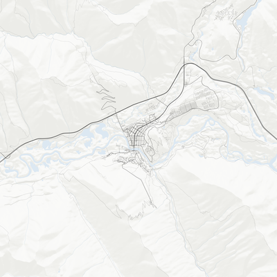</a><br>
      <sub>minimal_white</sub>
    </td>
    <td align="center">
      <a href="examples/full/banff-ab-natural.png">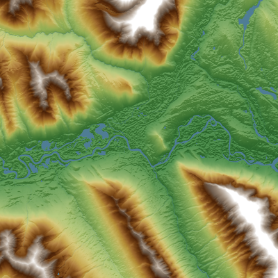</a><br>
      <sub>natural</sub>
    </td>
  </tr>
  <tr>
    <td align="center">
      <a href="examples/full/banff-ab-neon_cyber.png">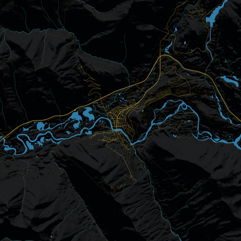</a><br>
      <sub>neon_cyber</sub>
    </td>
    <td align="center">
      <a href="examples/full/banff-ab-night.png">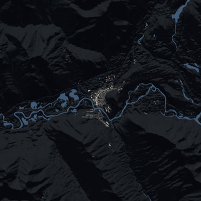</a><br>
      <sub>night</sub>
    </td>
    <td align="center">
      <a href="examples/full/banff-ab-porcelain_ink.png">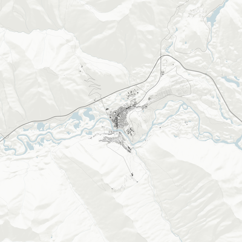</a><br>
      <sub>porcelain_ink</sub>
    </td>
    <td align="center">
      <a href="examples/full/banff-ab-river_runs_red.png">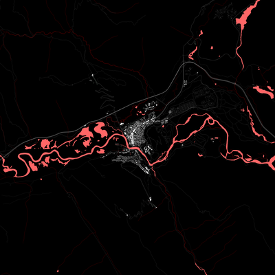</a><br>
      <sub>river_runs_red</sub>
    </td>
  </tr>
  <tr>
    <td align="center">
      <a href="examples/full/banff-ab-satellite.png">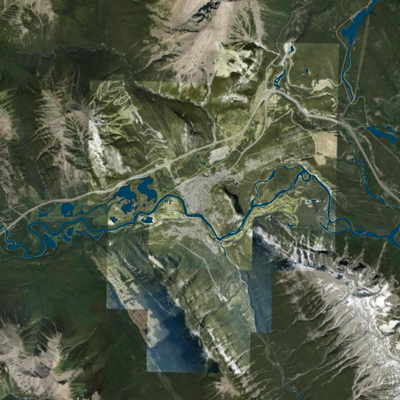</a><br>
      <sub>satellite</sub>
    </td>
    <td align="center">
      <a href="examples/full/banff-ab-sepia_vintage.png">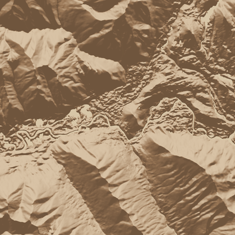</a><br>
      <sub>sepia_vintage</sub>
    </td>
    <td align="center">
      <a href="examples/full/banff-ab-slate.png">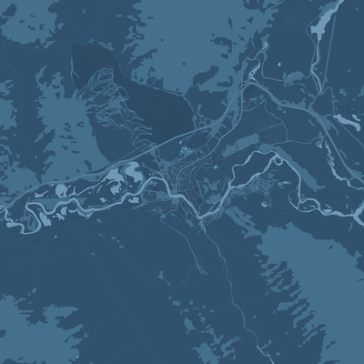</a><br>
      <sub>slate</sub>
    </td>
    <td align="center">
      <a href="examples/full/banff-ab-yellow.png">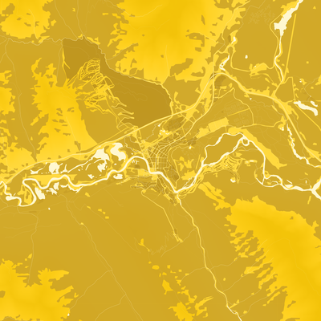</a><br>
      <sub>yellow</sub>
    </td>
  </tr>
</table>

### British Columbia

<table>
  <tr>
    <td align="center">
      <a href="examples/full/british-columbia-blueprint.png">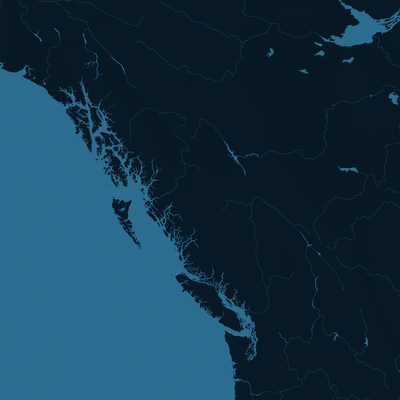</a><br>
      <sub>blueprint</sub>
    </td>
    <td align="center">
      <a href="examples/full/british-columbia-burgundy.png">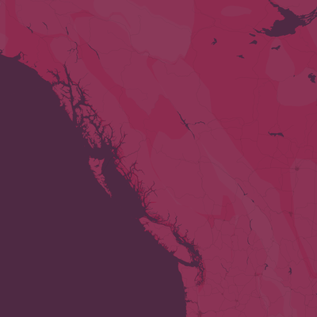</a><br>
      <sub>burgundy</sub>
    </td>
    <td align="center">
      <a href="examples/full/british-columbia-copper.png">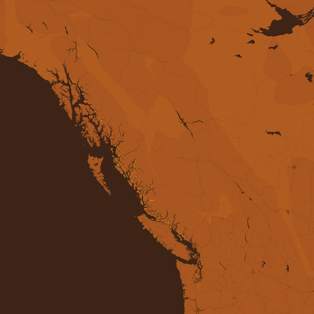</a><br>
      <sub>copper</sub>
    </td>
    <td align="center">
      <a href="examples/full/british-columbia-coral.png">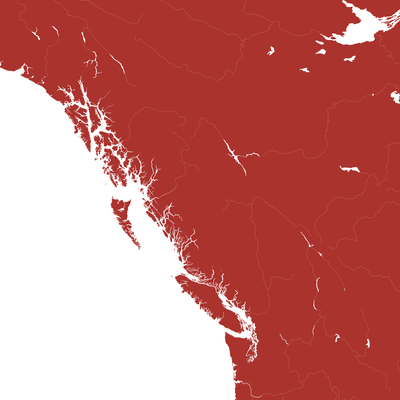</a><br>
      <sub>coral</sub>
    </td>
  </tr>
  <tr>
    <td align="center">
      <a href="examples/full/british-columbia-glacier.png">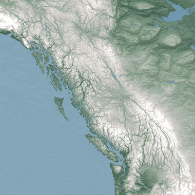</a><br>
      <sub>glacier</sub>
    </td>
    <td align="center">
      <a href="examples/full/british-columbia-lava.png">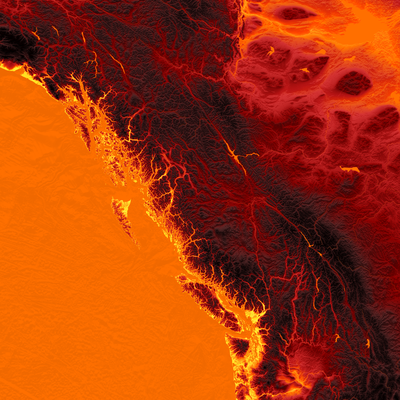</a><br>
      <sub>lava</sub>
    </td>
    <td align="center">
      <a href="examples/full/british-columbia-minimal_white.png">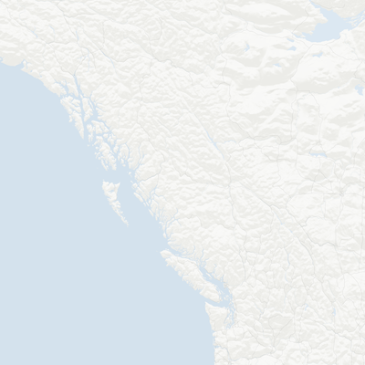</a><br>
      <sub>minimal_white</sub>
    </td>
    <td align="center">
      <a href="examples/full/british-columbia-natural.png">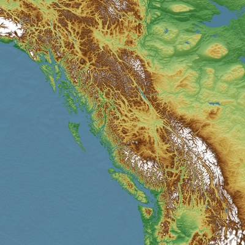</a><br>
      <sub>natural</sub>
    </td>
  </tr>
  <tr>
    <td align="center">
      <a href="examples/full/british-columbia-neon_cyber.png">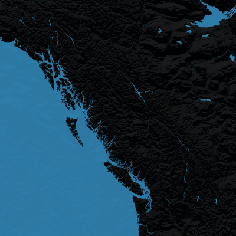</a><br>
      <sub>neon_cyber</sub>
    </td>
    <td align="center">
      <a href="examples/full/british-columbia-night.png">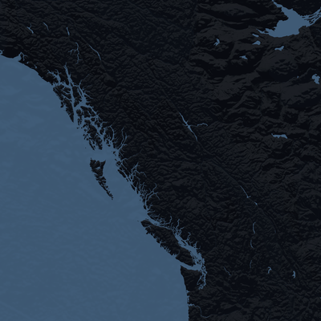</a><br>
      <sub>night</sub>
    </td>
    <td align="center">
      <a href="examples/full/british-columbia-porcelain_ink.png">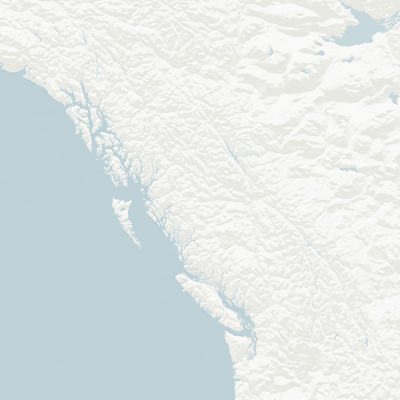</a><br>
      <sub>porcelain_ink</sub>
    </td>
    <td align="center">
      <a href="examples/full/british-columbia-river_runs_red.png">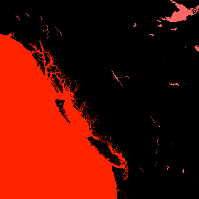</a><br>
      <sub>river_runs_red</sub>
    </td>
  </tr>
  <tr>
    <td align="center">
      <a href="examples/full/british-columbia-satellite.png">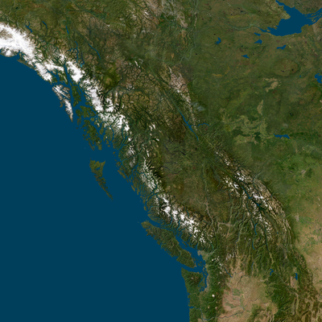</a><br>
      <sub>satellite</sub>
    </td>
    <td align="center">
      <a href="examples/full/british-columbia-sepia_vintage.png">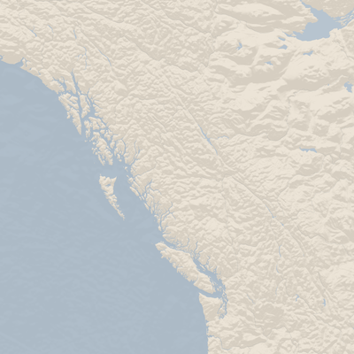</a><br>
      <sub>sepia_vintage</sub>
    </td>
    <td align="center">
      <a href="examples/full/british-columbia-slate.png">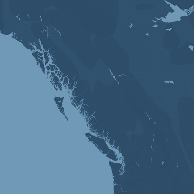</a><br>
      <sub>slate</sub>
    </td>
    <td align="center">
      <a href="examples/full/british-columbia-yellow.png">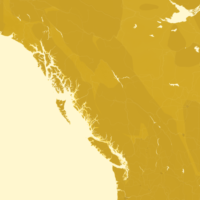</a><br>
      <sub>yellow</sub>
    </td>
  </tr>
</table>

### Cape Town, South Africa

<table>
  <tr>
    <td align="center">
      <a href="examples/full/cape-town-south-africa-blueprint.png">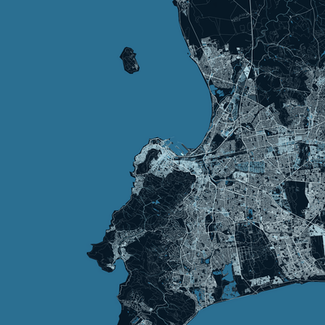</a><br>
      <sub>blueprint</sub>
    </td>
    <td align="center">
      <a href="examples/full/cape-town-south-africa-burgundy.png">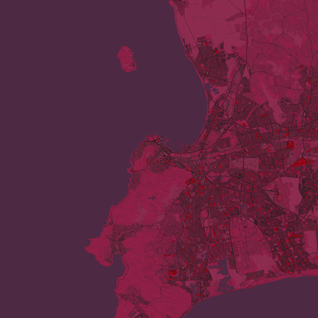</a><br>
      <sub>burgundy</sub>
    </td>
    <td align="center">
      <a href="examples/full/cape-town-south-africa-copper.png">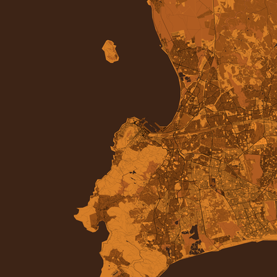</a><br>
      <sub>copper</sub>
    </td>
    <td align="center">
      <a href="examples/full/cape-town-south-africa-coral.png">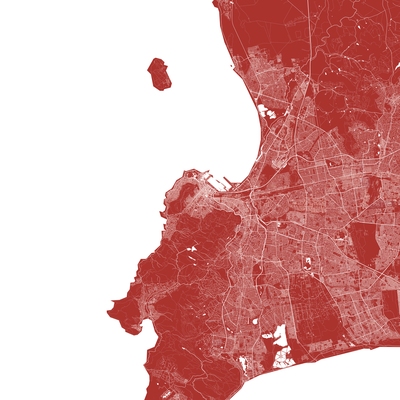</a><br>
      <sub>coral</sub>
    </td>
  </tr>
  <tr>
    <td align="center">
      <a href="examples/full/cape-town-south-africa-glacier.png">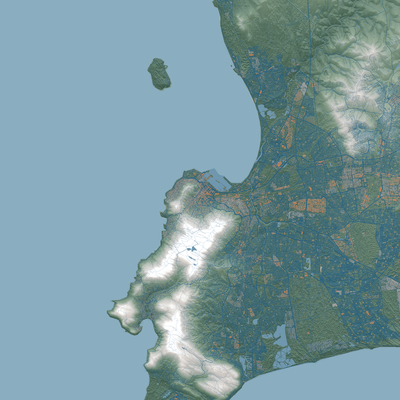</a><br>
      <sub>glacier</sub>
    </td>
    <td align="center">
      <a href="examples/full/cape-town-south-africa-lava.png">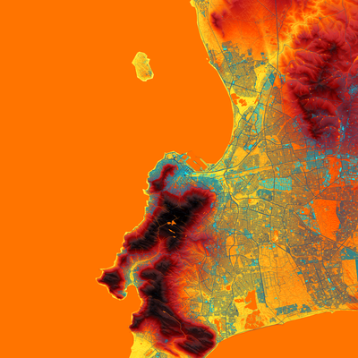</a><br>
      <sub>lava</sub>
    </td>
    <td align="center">
      <a href="examples/full/cape-town-south-africa-minimal_white.png">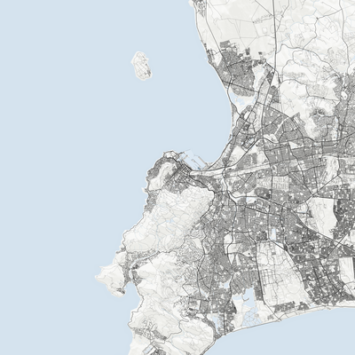</a><br>
      <sub>minimal_white</sub>
    </td>
    <td align="center">
      <a href="examples/full/cape-town-south-africa-natural.png">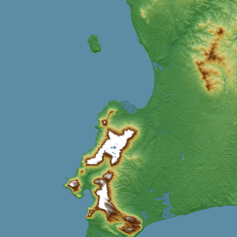</a><br>
      <sub>natural</sub>
    </td>
  </tr>
  <tr>
    <td align="center">
      <a href="examples/full/cape-town-south-africa-neon_cyber.png">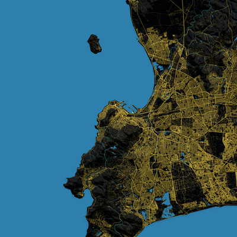</a><br>
      <sub>neon_cyber</sub>
    </td>
    <td align="center">
      <a href="examples/full/cape-town-south-africa-night.png">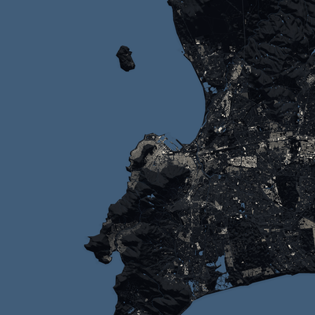</a><br>
      <sub>night</sub>
    </td>
    <td align="center">
      <a href="examples/full/cape-town-south-africa-porcelain_ink.png">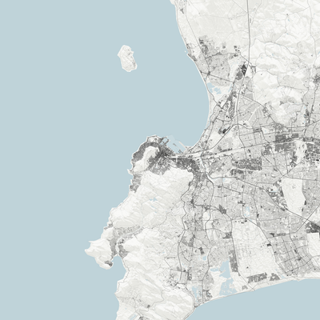</a><br>
      <sub>porcelain_ink</sub>
    </td>
    <td align="center">
      <a href="examples/full/cape-town-south-africa-river_runs_red.png">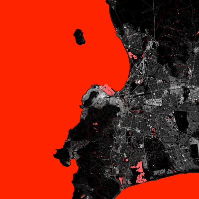</a><br>
      <sub>river_runs_red</sub>
    </td>
  </tr>
  <tr>
    <td align="center">
      <a href="examples/full/cape-town-south-africa-satellite.png">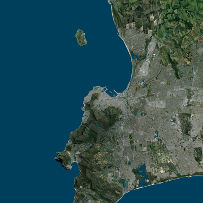</a><br>
      <sub>satellite</sub>
    </td>
    <td align="center">
      <a href="examples/full/cape-town-south-africa-sepia_vintage.png">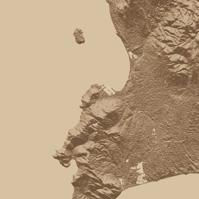</a><br>
      <sub>sepia_vintage</sub>
    </td>
    <td align="center">
      <a href="examples/full/cape-town-south-africa-slate.png">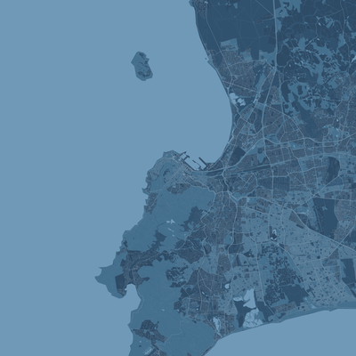</a><br>
      <sub>slate</sub>
    </td>
    <td align="center">
      <a href="examples/full/cape-town-south-africa-yellow.png">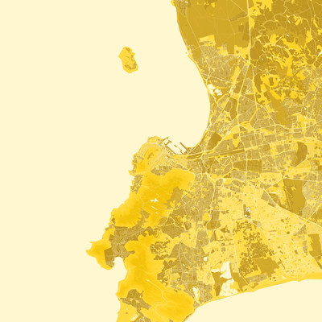</a><br>
      <sub>yellow</sub>
    </td>
  </tr>
</table>

### Edmonton, AB

<table>
  <tr>
    <td align="center">
      <a href="examples/full/edmonton-ab-blueprint.png">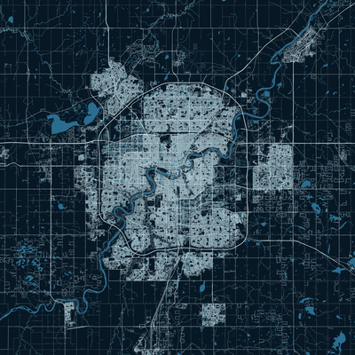</a><br>
      <sub>blueprint</sub>
    </td>
    <td align="center">
      <a href="examples/full/edmonton-ab-burgundy.png"></a><br>
      <sub>burgundy</sub>
    </td>
    <td align="center">
      <a href="examples/full/edmonton-ab-copper.png"></a><br>
      <sub>copper</sub>
    </td>
    <td align="center">
      <a href="examples/full/edmonton-ab-coral.png"></a><br>
      <sub>coral</sub>
    </td>
  </tr>
  <tr>
    <td align="center">
      <a href="examples/full/edmonton-ab-glacier.png"></a><br>
      <sub>glacier</sub>
    </td>
    <td align="center">
      <a href="examples/full/edmonton-ab-lava.png"></a><br>
      <sub>lava</sub>
    </td>
    <td align="center">
      <a href="examples/full/edmonton-ab-minimal_white.png"></a><br>
      <sub>minimal_white</sub>
    </td>
    <td align="center">
      <a href="examples/full/edmonton-ab-natural.png"></a><br>
      <sub>natural</sub>
    </td>
  </tr>
  <tr>
    <td align="center">
      <a href="examples/full/edmonton-ab-neon_cyber.png"></a><br>
      <sub>neon_cyber</sub>
    </td>
    <td align="center">
      <a href="examples/full/edmonton-ab-night.png"></a><br>
      <sub>night</sub>
    </td>
    <td align="center">
      <a href="examples/full/edmonton-ab-porcelain_ink.png"></a><br>
      <sub>porcelain_ink</sub>
    </td>
    <td align="center">
      <a href="examples/full/edmonton-ab-river_runs_red.png"></a><br>
      <sub>river_runs_red</sub>
    </td>
  </tr>
  <tr>
    <td align="center">
      <a href="examples/full/edmonton-ab-satellite.png"></a><br>
      <sub>satellite</sub>
    </td>
    <td align="center">
      <a href="examples/full/edmonton-ab-sepia_vintage.png"></a><br>
      <sub>sepia_vintage</sub>
    </td>
    <td align="center">
      <a href="examples/full/edmonton-ab-slate.png"></a><br>
      <sub>slate</sub>
    </td>
    <td align="center">
      <a href="examples/full/edmonton-ab-yellow.png"></a><br>
      <sub>yellow</sub>
    </td>
  </tr>
</table>

### Iceland

<table>
  <tr>
    <td align="center">
      <a href="examples/full/iceland-blueprint.png"></a><br>
      <sub>blueprint</sub>
    </td>
    <td align="center">
      <a href="examples/full/iceland-burgundy.png"></a><br>
      <sub>burgundy</sub>
    </td>
    <td align="center">
      <a href="examples/full/iceland-copper.png"></a><br>
      <sub>copper</sub>
    </td>
    <td align="center">
      <a href="examples/full/iceland-coral.png"></a><br>
      <sub>coral</sub>
    </td>
  </tr>
  <tr>
    <td align="center">
      <a href="examples/full/iceland-glacier.png"></a><br>
      <sub>glacier</sub>
    </td>
    <td align="center">
      <a href="examples/full/iceland-lava.png"></a><br>
      <sub>lava</sub>
    </td>
    <td align="center">
      <a href="examples/full/iceland-minimal_white.png"></a><br>
      <sub>minimal_white</sub>
    </td>
    <td align="center">
      <a href="examples/full/iceland-natural.png"></a><br>
      <sub>natural</sub>
    </td>
  </tr>
  <tr>
    <td align="center">
      <a href="examples/full/iceland-neon_cyber.png"></a><br>
      <sub>neon_cyber</sub>
    </td>
    <td align="center">
      <a href="examples/full/iceland-night.png"></a><br>
      <sub>night</sub>
    </td>
    <td align="center">
      <a href="examples/full/iceland-porcelain_ink.png"></a><br>
      <sub>porcelain_ink</sub>
    </td>
    <td align="center">
      <a href="examples/full/iceland-river_runs_red.png"></a><br>
      <sub>river_runs_red</sub>
    </td>
  </tr>
  <tr>
    <td align="center">
      <a href="examples/full/iceland-satellite.png"></a><br>
      <sub>satellite</sub>
    </td>
    <td align="center">
      <a href="examples/full/iceland-sepia_vintage.png"></a><br>
      <sub>sepia_vintage</sub>
    </td>
    <td align="center">
      <a href="examples/full/iceland-slate.png"></a><br>
      <sub>slate</sub>
    </td>
    <td align="center">
      <a href="examples/full/iceland-yellow.png"></a><br>
      <sub>yellow</sub>
    </td>
  </tr>
</table>

### Oahu, HI

<table>
  <tr>
    <td align="center">
      <a href="examples/full/oahu-hi-blueprint.png"></a><br>
      <sub>blueprint</sub>
    </td>
    <td align="center">
      <a href="examples/full/oahu-hi-burgundy.png"></a><br>
      <sub>burgundy</sub>
    </td>
    <td align="center">
      <a href="examples/full/oahu-hi-copper.png"></a><br>
      <sub>copper</sub>
    </td>
    <td align="center">
      <a href="examples/full/oahu-hi-coral.png"></a><br>
      <sub>coral</sub>
    </td>
  </tr>
  <tr>
    <td align="center">
      <a href="examples/full/oahu-hi-glacier.png"></a><br>
      <sub>glacier</sub>
    </td>
    <td align="center">
      <a href="examples/full/oahu-hi-lava.png"></a><br>
      <sub>lava</sub>
    </td>
    <td align="center">
      <a href="examples/full/oahu-hi-minimal_white.png"></a><br>
      <sub>minimal_white</sub>
    </td>
    <td align="center">
      <a href="examples/full/oahu-hi-natural.png"></a><br>
      <sub>natural</sub>
    </td>
  </tr>
  <tr>
    <td align="center">
      <a href="examples/full/oahu-hi-neon_cyber.png"></a><br>
      <sub>neon_cyber</sub>
    </td>
    <td align="center">
      <a href="examples/full/oahu-hi-night.png"></a><br>
      <sub>night</sub>
    </td>
    <td align="center">
      <a href="examples/full/oahu-hi-porcelain_ink.png"></a><br>
      <sub>porcelain_ink</sub>
    </td>
    <td align="center">
      <a href="examples/full/oahu-hi-river_runs_red.png"></a><br>
      <sub>river_runs_red</sub>
    </td>
  </tr>
  <tr>
    <td align="center">
      <a href="examples/full/oahu-hi-satellite.png"></a><br>
      <sub>satellite</sub>
    </td>
    <td align="center">
      <a href="examples/full/oahu-hi-sepia_vintage.png"></a><br>
      <sub>sepia_vintage</sub>
    </td>
    <td align="center">
      <a href="examples/full/oahu-hi-slate.png"></a><br>
      <sub>slate</sub>
    </td>
    <td align="center">
      <a href="examples/full/oahu-hi-yellow.png"></a><br>
      <sub>yellow</sub>
    </td>
  </tr>
</table>

### Patagonia

<table>
  <tr>
    <td align="center">
      <a href="examples/full/patagonia-blueprint.png"></a><br>
      <sub>blueprint</sub>
    </td>
    <td align="center">
      <a href="examples/full/patagonia-burgundy.png"></a><br>
      <sub>burgundy</sub>
    </td>
    <td align="center">
      <a href="examples/full/patagonia-copper.png"></a><br>
      <sub>copper</sub>
    </td>
    <td align="center">
      <a href="examples/full/patagonia-coral.png"></a><br>
      <sub>coral</sub>
    </td>
  </tr>
  <tr>
    <td align="center">
      <a href="examples/full/patagonia-glacier.png"></a><br>
      <sub>glacier</sub>
    </td>
    <td align="center">
      <a href="examples/full/patagonia-lava.png"></a><br>
      <sub>lava</sub>
    </td>
    <td align="center">
      <a href="examples/full/patagonia-minimal_white.png"></a><br>
      <sub>minimal_white</sub>
    </td>
    <td align="center">
      <a href="examples/full/patagonia-natural.png"></a><br>
      <sub>natural</sub>
    </td>
  </tr>
  <tr>
    <td align="center">
      <a href="examples/full/patagonia-neon_cyber.png"></a><br>
      <sub>neon_cyber</sub>
    </td>
    <td align="center">
      <a href="examples/full/patagonia-night.png"></a><br>
      <sub>night</sub>
    </td>
    <td align="center">
      <a href="examples/full/patagonia-porcelain_ink.png"></a><br>
      <sub>porcelain_ink</sub>
    </td>
    <td align="center">
      <a href="examples/full/patagonia-river_runs_red.png"></a><br>
      <sub>river_runs_red</sub>
    </td>
  </tr>
  <tr>
    <td align="center">
      <a href="examples/full/patagonia-satellite.png"></a><br>
      <sub>satellite</sub>
    </td>
    <td align="center">
      <a href="examples/full/patagonia-sepia_vintage.png"></a><br>
      <sub>sepia_vintage</sub>
    </td>
    <td align="center">
      <a href="examples/full/patagonia-slate.png"></a><br>
      <sub>slate</sub>
    </td>
    <td align="center">
      <a href="examples/full/patagonia-yellow.png"></a><br>
      <sub>yellow</sub>
    </td>
  </tr>
</table>

### San Francisco, CA

<table>
  <tr>
    <td align="center">
      <a href="examples/full/san-francisco-ca-blueprint.png"></a><br>
      <sub>blueprint</sub>
    </td>
    <td align="center">
      <a href="examples/full/san-francisco-ca-burgundy.png"></a><br>
      <sub>burgundy</sub>
    </td>
    <td align="center">
      <a href="examples/full/san-francisco-ca-copper.png"></a><br>
      <sub>copper</sub>
    </td>
    <td align="center">
      <a href="examples/full/san-francisco-ca-coral.png"></a><br>
      <sub>coral</sub>
    </td>
  </tr>
  <tr>
    <td align="center">
      <a href="examples/full/san-francisco-ca-glacier.png"></a><br>
      <sub>glacier</sub>
    </td>
    <td align="center">
      <a href="examples/full/san-francisco-ca-lava.png"></a><br>
      <sub>lava</sub>
    </td>
    <td align="center">
      <a href="examples/full/san-francisco-ca-minimal_white.png"></a><br>
      <sub>minimal_white</sub>
    </td>
    <td align="center">
      <a href="examples/full/san-francisco-ca-natural.png"></a><br>
      <sub>natural</sub>
    </td>
  </tr>
  <tr>
    <td align="center">
      <a href="examples/full/san-francisco-ca-neon_cyber.png"></a><br>
      <sub>neon_cyber</sub>
    </td>
    <td align="center">
      <a href="examples/full/san-francisco-ca-night.png"></a><br>
      <sub>night</sub>
    </td>
    <td align="center">
      <a href="examples/full/san-francisco-ca-porcelain_ink.png"></a><br>
      <sub>porcelain_ink</sub>
    </td>
    <td align="center">
      <a href="examples/full/san-francisco-ca-river_runs_red.png"></a><br>
      <sub>river_runs_red</sub>
    </td>
  </tr>
  <tr>
    <td align="center">
      <a href="examples/full/san-francisco-ca-satellite.png"></a><br>
      <sub>satellite</sub>
    </td>
    <td align="center">
      <a href="examples/full/san-francisco-ca-sepia_vintage.png"></a><br>
      <sub>sepia_vintage</sub>
    </td>
    <td align="center">
      <a href="examples/full/san-francisco-ca-slate.png"></a><br>
      <sub>slate</sub>
    </td>
    <td align="center">
      <a href="examples/full/san-francisco-ca-yellow.png"></a><br>
      <sub>yellow</sub>
    </td>
  </tr>
</table>

### Vancouver, BC

<table>
  <tr>
    <td align="center">
      <a href="examples/full/vancouver-bc-blueprint.png"></a><br>
      <sub>blueprint</sub>
    </td>
    <td align="center">
      <a href="examples/full/vancouver-bc-burgundy.png"></a><br>
      <sub>burgundy</sub>
    </td>
    <td align="center">
      <a href="examples/full/vancouver-bc-copper.png"></a><br>
      <sub>copper</sub>
    </td>
    <td align="center">
      <a href="examples/full/vancouver-bc-coral.png"></a><br>
      <sub>coral</sub>
    </td>
  </tr>
  <tr>
    <td align="center">
      <a href="examples/full/vancouver-bc-glacier.png"></a><br>
      <sub>glacier</sub>
    </td>
    <td align="center">
      <a href="examples/full/vancouver-bc-lava.png"></a><br>
      <sub>lava</sub>
    </td>
    <td align="center">
      <a href="examples/full/vancouver-bc-minimal_white.png"></a><br>
      <sub>minimal_white</sub>
    </td>
    <td align="center">
      <a href="examples/full/vancouver-bc-natural.png"></a><br>
      <sub>natural</sub>
    </td>
  </tr>
  <tr>
    <td align="center">
      <a href="examples/full/vancouver-bc-neon_cyber.png"></a><br>
      <sub>neon_cyber</sub>
    </td>
    <td align="center">
      <a href="examples/full/vancouver-bc-night.png"></a><br>
      <sub>night</sub>
    </td>
    <td align="center">
      <a href="examples/full/vancouver-bc-porcelain_ink.png"></a><br>
      <sub>porcelain_ink</sub>
    </td>
    <td align="center">
      <a href="examples/full/vancouver-bc-river_runs_red.png"></a><br>
      <sub>river_runs_red</sub>
    </td>
  </tr>
  <tr>
    <td align="center">
      <a href="examples/full/vancouver-bc-satellite.png"></a><br>
      <sub>satellite</sub>
    </td>
    <td align="center">
      <a href="examples/full/vancouver-bc-sepia_vintage.png"></a><br>
      <sub>sepia_vintage</sub>
    </td>
    <td align="center">
      <a href="examples/full/vancouver-bc-slate.png"></a><br>
      <sub>slate</sub>
    </td>
    <td align="center">
      <a href="examples/full/vancouver-bc-yellow.png"></a><br>
      <sub>yellow</sub>
    </td>
  </tr>
</table>

### Vancouver Island, BC

<table>
  <tr>
    <td align="center">
      <a href="examples/full/vancouver-island-bc-blueprint.png"></a><br>
      <sub>blueprint</sub>
    </td>
    <td align="center">
      <a href="examples/full/vancouver-island-bc-burgundy.png"></a><br>
      <sub>burgundy</sub>
    </td>
    <td align="center">
      <a href="examples/full/vancouver-island-bc-copper.png"></a><br>
      <sub>copper</sub>
    </td>
    <td align="center">
      <a href="examples/full/vancouver-island-bc-coral.png"></a><br>
      <sub>coral</sub>
    </td>
  </tr>
  <tr>
    <td align="center">
      <a href="examples/full/vancouver-island-bc-glacier.png"></a><br>
      <sub>glacier</sub>
    </td>
    <td align="center">
      <a href="examples/full/vancouver-island-bc-lava.png"></a><br>
      <sub>lava</sub>
    </td>
    <td align="center">
      <a href="examples/full/vancouver-island-bc-minimal_white.png"></a><br>
      <sub>minimal_white</sub>
    </td>
    <td align="center">
      <a href="examples/full/vancouver-island-bc-natural.png"></a><br>
      <sub>natural</sub>
    </td>
  </tr>
  <tr>
    <td align="center">
      <a href="examples/full/vancouver-island-bc-neon_cyber.png"></a><br>
      <sub>neon_cyber</sub>
    </td>
    <td align="center">
      <a href="examples/full/vancouver-island-bc-night.png"></a><br>
      <sub>night</sub>
    </td>
    <td align="center">
      <a href="examples/full/vancouver-island-bc-porcelain_ink.png"></a><br>
      <sub>porcelain_ink</sub>
    </td>
    <td align="center">
      <a href="examples/full/vancouver-island-bc-river_runs_red.png"></a><br>
      <sub>river_runs_red</sub>
    </td>
  </tr>
  <tr>
    <td align="center">
      <a href="examples/full/vancouver-island-bc-satellite.png"></a><br>
      <sub>satellite</sub>
    </td>
    <td align="center">
      <a href="examples/full/vancouver-island-bc-sepia_vintage.png"></a><br>
      <sub>sepia_vintage</sub>
    </td>
    <td align="center">
      <a href="examples/full/vancouver-island-bc-slate.png"></a><br>
      <sub>slate</sub>
    </td>
    <td align="center">
      <a href="examples/full/vancouver-island-bc-yellow.png"></a><br>
      <sub>yellow</sub>
    </td>
  </tr>
</table>

### Vestland, Norway

<table>
  <tr>
    <td align="center">
      <a href="examples/full/vestland-norway-blueprint.png"></a><br>
      <sub>blueprint</sub>
    </td>
    <td align="center">
      <a href="examples/full/vestland-norway-burgundy.png"></a><br>
      <sub>burgundy</sub>
    </td>
    <td align="center">
      <a href="examples/full/vestland-norway-copper.png"></a><br>
      <sub>copper</sub>
    </td>
    <td align="center">
      <a href="examples/full/vestland-norway-coral.png"></a><br>
      <sub>coral</sub>
    </td>
  </tr>
  <tr>
    <td align="center">
      <a href="examples/full/vestland-norway-glacier.png"></a><br>
      <sub>glacier</sub>
    </td>
    <td align="center">
      <a href="examples/full/vestland-norway-lava.png"></a><br>
      <sub>lava</sub>
    </td>
    <td align="center">
      <a href="examples/full/vestland-norway-minimal_white.png"></a><br>
      <sub>minimal_white</sub>
    </td>
    <td align="center">
      <a href="examples/full/vestland-norway-natural.png"></a><br>
      <sub>natural</sub>
    </td>
  </tr>
  <tr>
    <td align="center">
      <a href="examples/full/vestland-norway-neon_cyber.png"></a><br>
      <sub>neon_cyber</sub>
    </td>
    <td align="center">
      <a href="examples/full/vestland-norway-night.png"></a><br>
      <sub>night</sub>
    </td>
    <td align="center">
      <a href="examples/full/vestland-norway-porcelain_ink.png"></a><br>
      <sub>porcelain_ink</sub>
    </td>
    <td align="center">
      <a href="examples/full/vestland-norway-river_runs_red.png"></a><br>
      <sub>river_runs_red</sub>
    </td>
  </tr>
  <tr>
    <td align="center">
      <a href="examples/full/vestland-norway-satellite.png"></a><br>
      <sub>satellite</sub>
    </td>
    <td align="center">
      <a href="examples/full/vestland-norway-sepia_vintage.png"></a><br>
      <sub>sepia_vintage</sub>
    </td>
    <td align="center">
      <a href="examples/full/vestland-norway-slate.png"></a><br>
      <sub>slate</sub>
    </td>
    <td align="center">
      <a href="examples/full/vestland-norway-yellow.png"></a><br>
      <sub>yellow</sub>
    </td>
  </tr>
</table>

### Route Map Examples

Route maps overlay a GPX track onto the map and include a stats panel with ride title, subtitle, and custom metrics. Two variants are supported: a region-bounded map (the map region is defined by a place name, with the GPX track drawn on top) and a GPX-derived map (the map region is derived directly from the GPX track bounding box, with no separate region argument required).

#### Edmonton Loop — Region + GPX Route

<table>
  <tr>
    <td align="center">
      <a href="examples/full/edmonton-ab-route-edmonton-110km-blueprint.png"></a><br>
      <sub>blueprint</sub>
    </td>
    <td align="center">
      <a href="examples/full/edmonton-ab-route-edmonton-110km-burgundy.png"></a><br>
      <sub>burgundy</sub>
    </td>
    <td align="center">
      <a href="examples/full/edmonton-ab-route-edmonton-110km-copper.png"></a><br>
      <sub>copper</sub>
    </td>
    <td align="center">
      <a href="examples/full/edmonton-ab-route-edmonton-110km-coral.png"></a><br>
      <sub>coral</sub>
    </td>
  </tr>
  <tr>
    <td align="center">
      <a href="examples/full/edmonton-ab-route-edmonton-110km-glacier.png"></a><br>
      <sub>glacier</sub>
    </td>
    <td align="center">
      <a href="examples/full/edmonton-ab-route-edmonton-110km-lava.png"></a><br>
      <sub>lava</sub>
    </td>
    <td align="center">
      <a href="examples/full/edmonton-ab-route-edmonton-110km-minimal_white.png"></a><br>
      <sub>minimal_white</sub>
    </td>
    <td align="center">
      <a href="examples/full/edmonton-ab-route-edmonton-110km-natural.png"></a><br>
      <sub>natural</sub>
    </td>
  </tr>
  <tr>
    <td align="center">
      <a href="examples/full/edmonton-ab-route-edmonton-110km-neon_cyber.png"></a><br>
      <sub>neon_cyber</sub>
    </td>
    <td align="center">
      <a href="examples/full/edmonton-ab-route-edmonton-110km-night.png"></a><br>
      <sub>night</sub>
    </td>
    <td align="center">
      <a href="examples/full/edmonton-ab-route-edmonton-110km-porcelain_ink.png"></a><br>
      <sub>porcelain_ink</sub>
    </td>
    <td align="center">
      <a href="examples/full/edmonton-ab-route-edmonton-110km-river_runs_red.png"></a><br>
      <sub>river_runs_red</sub>
    </td>
  </tr>
  <tr>
    <td align="center">
      <a href="examples/full/edmonton-ab-route-edmonton-110km-satellite.png"></a><br>
      <sub>satellite</sub>
    </td>
    <td align="center">
      <a href="examples/full/edmonton-ab-route-edmonton-110km-sepia_vintage.png"></a><br>
      <sub>sepia_vintage</sub>
    </td>
    <td align="center">
      <a href="examples/full/edmonton-ab-route-edmonton-110km-slate.png"></a><br>
      <sub>slate</sub>
    </td>
    <td align="center">
      <a href="examples/full/edmonton-ab-route-edmonton-110km-yellow.png"></a><br>
      <sub>yellow</sub>
    </td>
  </tr>
</table>

#### River Valley Loop — GPX-Derived Route

<table>
  <tr>
    <td align="center">
      <a href="examples/full/edmonton-50km-blueprint.png"></a><br>
      <sub>blueprint</sub>
    </td>
    <td align="center">
      <a href="examples/full/edmonton-50km-burgundy.png"></a><br>
      <sub>burgundy</sub>
    </td>
    <td align="center">
      <a href="examples/full/edmonton-50km-copper.png"></a><br>
      <sub>copper</sub>
    </td>
    <td align="center">
      <a href="examples/full/edmonton-50km-coral.png"></a><br>
      <sub>coral</sub>
    </td>
  </tr>
  <tr>
    <td align="center">
      <a href="examples/full/edmonton-50km-glacier.png"></a><br>
      <sub>glacier</sub>
    </td>
    <td align="center">
      <a href="examples/full/edmonton-50km-lava.png"></a><br>
      <sub>lava</sub>
    </td>
    <td align="center">
      <a href="examples/full/edmonton-50km-minimal_white.png"></a><br>
      <sub>minimal_white</sub>
    </td>
    <td align="center">
      <a href="examples/full/edmonton-50km-natural.png"></a><br>
      <sub>natural</sub>
    </td>
  </tr>
  <tr>
    <td align="center">
      <a href="examples/full/edmonton-50km-neon_cyber.png"></a><br>
      <sub>neon_cyber</sub>
    </td>
    <td align="center">
      <a href="examples/full/edmonton-50km-night.png"></a><br>
      <sub>night</sub>
    </td>
    <td align="center">
      <a href="examples/full/edmonton-50km-porcelain_ink.png"></a><br>
      <sub>porcelain_ink</sub>
    </td>
    <td align="center">
      <a href="examples/full/edmonton-50km-river_runs_red.png"></a><br>
      <sub>river_runs_red</sub>
    </td>
  </tr>
  <tr>
    <td align="center">
      <a href="examples/full/edmonton-50km-satellite.png"></a><br>
      <sub>satellite</sub>
    </td>
    <td align="center">
      <a href="examples/full/edmonton-50km-sepia_vintage.png"></a><br>
      <sub>sepia_vintage</sub>
    </td>
    <td align="center">
      <a href="examples/full/edmonton-50km-slate.png"></a><br>
      <sub>slate</sub>
    </td>
    <td align="center">
      <a href="examples/full/edmonton-50km-yellow.png"></a><br>
      <sub>yellow</sub>
    </td>
  </tr>
</table>

#### South Shore Coastal Ride — GPX-Derived Route

<table>
  <tr>
    <td align="center">
      <a href="examples/full/south-shore-coastal-ride-blueprint.png"></a><br>
      <sub>blueprint</sub>
    </td>
    <td align="center">
      <a href="examples/full/south-shore-coastal-ride-burgundy.png"></a><br>
      <sub>burgundy</sub>
    </td>
    <td align="center">
      <a href="examples/full/south-shore-coastal-ride-copper.png"></a><br>
      <sub>copper</sub>
    </td>
    <td align="center">
      <a href="examples/full/south-shore-coastal-ride-coral.png"></a><br>
      <sub>coral</sub>
    </td>
  </tr>
  <tr>
    <td align="center">
      <a href="examples/full/south-shore-coastal-ride-glacier.png"></a><br>
      <sub>glacier</sub>
    </td>
    <td align="center">
      <a href="examples/full/south-shore-coastal-ride-lava.png"></a><br>
      <sub>lava</sub>
    </td>
    <td align="center">
      <a href="examples/full/south-shore-coastal-ride-minimal_white.png"></a><br>
      <sub>minimal_white</sub>
    </td>
    <td align="center">
      <a href="examples/full/south-shore-coastal-ride-natural.png"></a><br>
      <sub>natural</sub>
    </td>
  </tr>
  <tr>
    <td align="center">
      <a href="examples/full/south-shore-coastal-ride-neon_cyber.png"></a><br>
      <sub>neon_cyber</sub>
    </td>
    <td align="center">
      <a href="examples/full/south-shore-coastal-ride-night.png"></a><br>
      <sub>night</sub>
    </td>
    <td align="center">
      <a href="examples/full/south-shore-coastal-ride-porcelain_ink.png"></a><br>
      <sub>porcelain_ink</sub>
    </td>
    <td align="center">
      <a href="examples/full/south-shore-coastal-ride-river_runs_red.png"></a><br>
      <sub>river_runs_red</sub>
    </td>
  </tr>
  <tr>
    <td align="center">
      <a href="examples/full/south-shore-coastal-ride-satellite.png"></a><br>
      <sub>satellite</sub>
    </td>
    <td align="center">
      <a href="examples/full/south-shore-coastal-ride-sepia_vintage.png"></a><br>
      <sub>sepia_vintage</sub>
    </td>
    <td align="center">
      <a href="examples/full/south-shore-coastal-ride-slate.png"></a><br>
      <sub>slate</sub>
    </td>
    <td align="center">
      <a href="examples/full/south-shore-coastal-ride-yellow.png"></a><br>
      <sub>yellow</sub>
    </td>
  </tr>
</table>

#### Boston-Emerald Necklace Bicycle Adventure — GPX-Derived Route

<table>
  <tr>
    <td align="center">
      <a href="examples/full/boston-emerald-necklace-bicycle-adventure-blueprint.png"></a><br>
      <sub>blueprint</sub>
    </td>
    <td align="center">
      <a href="examples/full/boston-emerald-necklace-bicycle-adventure-burgundy.png"></a><br>
      <sub>burgundy</sub>
    </td>
    <td align="center">
      <a href="examples/full/boston-emerald-necklace-bicycle-adventure-copper.png"></a><br>
      <sub>copper</sub>
    </td>
    <td align="center">
      <a href="examples/full/boston-emerald-necklace-bicycle-adventure-coral.png"></a><br>
      <sub>coral</sub>
    </td>
  </tr>
  <tr>
    <td align="center">
      <a href="examples/full/boston-emerald-necklace-bicycle-adventure-glacier.png"></a><br>
      <sub>glacier</sub>
    </td>
    <td align="center">
      <a href="examples/full/boston-emerald-necklace-bicycle-adventure-lava.png"></a><br>
      <sub>lava</sub>
    </td>
    <td align="center">
      <a href="examples/full/boston-emerald-necklace-bicycle-adventure-minimal_white.png"></a><br>
      <sub>minimal_white</sub>
    </td>
    <td align="center">
      <a href="examples/full/boston-emerald-necklace-bicycle-adventure-natural.png"></a><br>
      <sub>natural</sub>
    </td>
  </tr>
  <tr>
    <td align="center">
      <a href="examples/full/boston-emerald-necklace-bicycle-adventure-neon_cyber.png"></a><br>
      <sub>neon_cyber</sub>
    </td>
    <td align="center">
      <a href="examples/full/boston-emerald-necklace-bicycle-adventure-night.png"></a><br>
      <sub>night</sub>
    </td>
    <td align="center">
      <a href="examples/full/boston-emerald-necklace-bicycle-adventure-porcelain_ink.png"></a><br>
      <sub>porcelain_ink</sub>
    </td>
    <td align="center">
      <a href="examples/full/boston-emerald-necklace-bicycle-adventure-river_runs_red.png"></a><br>
      <sub>river_runs_red</sub>
    </td>
  </tr>
  <tr>
    <td align="center">
      <a href="examples/full/boston-emerald-necklace-bicycle-adventure-satellite.png"></a><br>
      <sub>satellite</sub>
    </td>
    <td align="center">
      <a href="examples/full/boston-emerald-necklace-bicycle-adventure-sepia_vintage.png"></a><br>
      <sub>sepia_vintage</sub>
    </td>
    <td align="center">
      <a href="examples/full/boston-emerald-necklace-bicycle-adventure-slate.png"></a><br>
      <sub>slate</sub>
    </td>
    <td align="center">
      <a href="examples/full/boston-emerald-necklace-bicycle-adventure-yellow.png"></a><br>
      <sub>yellow</sub>
    </td>
  </tr>
</table>

## Customizing a Map

Each build produces two auto-generated files in your workspace:

- `user/configs/{location}-base.yaml` — full generated config
- `user/configs/{location}-{scheme}-final.yaml` — final merged config (used for rendering)
- `user/configs/{location}-{scheme}-overlay.yaml` — your optional customizations (place here to auto-apply)

Create an overlay file named `user/configs/{location}-{scheme}-overlay.yaml` in your workspace. The build detects it automatically and deep-merges it over the base config to produce the final config.

```bash
# 1. Build the map first to generate the config files
just build "Edmonton, AB" coral

# 2. Copy the current final config as your overlay starting point
cp user/configs/edmonton-ab-coral-final.yaml user/configs/edmonton-ab-coral-overlay.yaml

# 3. Edit it — change whatever you like; leave everything else as-is
vi user/configs/edmonton-ab-coral-overlay.yaml

# 4. Rebuild — the overlay is applied automatically
just build "Edmonton, AB" coral
```

Leaving unchanged keys in the overlay is fine — the merge just keeps the same value. The base config is the raw generated config, while the `-final` file is the scheme-specific rendered config after overlay merging, so it is the better starting point if you want to copy what the map is currently using. The `{location}` is the region name lowercased with spaces and commas replaced by hyphens (e.g. `Edmonton, AB` → `edmonton-ab`).

## Adding New Color Schemes

To create a new color scheme, simply add a new YAML file to the `schemes/` directory. Each color scheme defines styling for all map layers (terrain, hillshade, water, roads, buildings, etc.), including colors, visibility, opacity, line weights, and more.

The easiest approach is to copy an existing scheme file (e.g., `coral.yaml`, `natural.yaml`, `glacier.yaml`) as a starting point, rename it, and modify the colors and settings to your liking:

```bash
# Copy an existing scheme as a template
cp schemes/coral.yaml schemes/my_scheme.yaml

# Edit the new scheme file
vi schemes/my_scheme.yaml

# The scheme is now available immediately
just build "Location" my_scheme
```

The scheme file should contain a YAML structure with `map` and layer-specific settings. For example:

```yaml
map:
  background:
    fc: "#ffffff"
    ec: "#ffffff"
  scheme: my_scheme
  # ... terrain, hillshade, satellite settings
water:
  fc: "#0000ff"
  ec: "#0000ff"
  alpha: 1.0
  # ... other water settings
# ... other layers (waterway, road, building, etc.)
```

After adding your YAML file to `schemes/`, the new color scheme is automatically discovered and can be used in builds without any code changes.

## Ocean Data

For coastal regions, the pipeline can derive an ocean layer from the **World Seas (IHO Sea Areas)** dataset. Download `World_Seas_IHO_v3.zip` from [marineregions.org/downloads.php](https://www.marineregions.org/downloads.php), extract it, and place the files into `downloads/ocean-boundaries/`. The build will skip ocean processing silently if this directory is absent.

## Project Structure

```text
schemes/                     # Color scheme definitions (YAML files)
  coral.yaml                 # Coral color scheme
  natural.yaml               # Natural color scheme
  burgundy.yaml              # Burgundy color scheme
  yellow.yaml                # Yellow color scheme
  copper.yaml                # Copper color scheme
  slate.yaml                 # Slate color scheme
  # ... other schemes

scripts/                     # Pipeline scripts

examples/                    # Example maps workspace (tracked in Git)
  configs/                   # Example map configs
  downloads/                 # Example map data
  output/                    # Example map outputs
  cache/                     # Example cache

user/                        # Your workspace (ignored by Git)
  downloads/
    regions/                 # Per-region data (auto-downloaded by build / build-route)
      edmonton-ab/
        area.geojson         # Boundary polygon
        dem.tif              # Digital elevation model
        satellite.tif        # Satellite imagery
        layers/*.gpkg        # Vector layers (roads, water, etc.)
    routes/                  # Per-GPX data (auto-downloaded by build-gpx)
      edmonton-50km/
        area.geojson
        dem.tif
        satellite.tif
        layers/*.gpkg
    ocean-boundaries/        # IHO World Seas source (manual download)
  configs/                   # Base configs and optional overlays
  output/                    # Rendered maps
  cache/                     # OSM query cache (safe to delete)
```

## Cache

OSM query responses are cached in your workspace's `cache/` directory (by default `user/cache/`). It can be deleted at any time to force fresh downloads.

## Author

Created by Paul Stothard.

## License

This project is licensed under the MIT License - see the [LICENSE](LICENSE) file for details.
